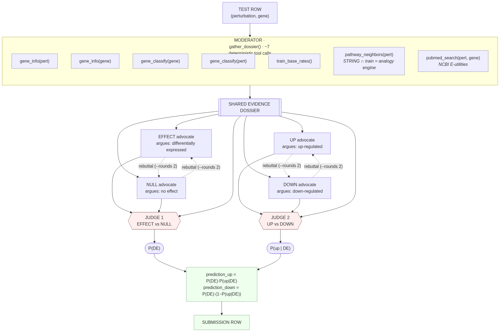

# BioReasoning Challenge -- MLGenX LLM Perturbation Competition

<p align="center">
  
</p>

Predict gene expression changes from CRISPRi perturbations in mouse bone marrow-derived macrophages (BMDMs).

## Website
Please checkout [the website](https://genentech.github.io/BioReasoningChallenge/) for full details!

---

## My submission (Jiawei Xing)

> This repository is my competition entry, built on top of the organizers' starter kit
> (upstream: [`genentech/bioreasoningchallenge`](https://github.com/genentech/bioreasoningchallenge)).
> The sections below the divider are the original starter-kit docs; everything in
> `examples/track_b_adversarial.py`, `examples/tools/`, the benchmark harness, and
> `docs/track_b_architecture.md` is my own work.

**Task.** Given a `(perturbation, gene)` pair, predict the ternary effect of CRISPRi
knockdown on the target gene in mouse BMDMs (`up` / `down` / `none`). Scored as the mean
of two micro-AUROCs: **DE** (any effect vs none) and **DIR** (up vs down among DE-positive
rows). The train/test split is **disjoint on both the perturbation and gene axes**, so no
target gene's behavior can be memorized from training — the model must reason about an
unseen `(pert, gene)` interaction.

### Track B — adversarial-debate agent (the centerpiece)

Because the metric is two *independent* AUROCs, I decomposed the prediction into two
matched debates instead of one classifier. Per row, a moderator deterministically gathers
a shared evidence **dossier** via tools, then runs:

- **Debate 1 → DE:** an EFFECT advocate vs a NULL advocate, scored by a judge → `P(DE)`
- **Debate 2 → DIR:** an UP advocate vs a DOWN advocate → `P(up | DE)`
- `prediction_up = P(DE)·P(up|DE)`, `prediction_down = P(DE)·(1−P(up|DE))`

Judges emit *continuous calibrated* probabilities (AUROC rewards ranking, not hard
labels). The key tool is `pathway_neighbors` — since exact lookups return nothing on the
disjoint split, it finds a perturbation's STRING network partners that *do* appear in
train and pools their knockdown label distribution (analogy, not memorization). See
[`docs/track_b_architecture.md`](docs/track_b_architecture.md) for the full design.

<p align="center">
  
</p>

**Result:** public leaderboard ≈ **0.624** on Track B.

### Tracks A & C

- **Track A (prompt-only, GPT-OSS-120B):** derive continuous probabilities from the
  softmax over the answer-token logprobs (`track_a_logprobs.py`) rather than parsing a
  hard label, then average over 3 seeds — turning AUROC's appetite for ranking into a
  scoring lever.
- **Track C (fine-tuning):** LoRA SFT of a <10B open model, served with vLLM at inference.

### What I learned (incl. honest negatives)

Rigor here is mostly about *not* chasing noise:

- **DE detection is information-limited (~0.55), not prompt/effort/retrieval-limited.**
  Sharpening the judge to suppress "famous-regulator" false positives was a real, isolated
  win; literature RAG, a learned feature combiner, and higher judge reasoning-effort all
  came back **negative/noise** in paired offline benchmarks.
- **Sharpening the *direction* judge the same way did not transfer — the DIR component is
  already near its ceiling.** The sharp-DE judge gave +0.065, so the natural next move was a
  matching `JUDGE_DIR_SYSTEM_NUMERIC_SHARP` (up:down base-rate anchor, knockdown
  sign-inversion rule, forced mechanistic-flag use). A 500-row paired A/B
  (`examples/benchmark_track_b_dir.py`) gave **DIR +0.016, mean −0.005** — and that +0.016
  is *inside the noise floor*: DE AUROC should be identical across the two arms by
  construction (the DIR judge can't touch `pred_up+pred_down = P(DE)`), yet it drifted 0.026
  from sampling alone. The paired P(up|DE) check explains why: the sharp prompt pushed both
  true-up (+0.083) and true-down (+0.077) rows up toward its anchor, so the *level* moved but
  the discriminating up−down separation barely did (+0.007) and spread actually shrank. It
  recalibrates, it doesn't discriminate — so it stays gated off (`MLGENX_SHARP_DIR=0`).
- **A gene regulatory network doesn't recover the indirect effects either.** The natural
  next idea — propagate a knockdown through a directed GRN instead of needing a documented
  (pert, gene) pair — is the right *representation* but fails in practice. A free CPU
  feature test (`examples/grn_feature_test.py`: OmniPath signaling + CollecTRI, 70k edges)
  scored network reachability/proximity at **DE AUROC 0.510 = chance** on full train (equal
  to a pert-hubness control), and signed propagation gave **DIR 0.549 with a 95% CI that
  crosses 0.50** on only 15% of rows. Two structural reasons: thin coverage (16% of pairs
  reachable) and *reachability saturation* (in a dense network almost everything connects,
  so topology can't discriminate without quantitative, macrophage-context edge weights —
  which is the STATE gap again).
- **A perturbation foundation model is the strongest external lever — and still not
  enough.** Geneformer V2-104M, run as an *in-silico CRISPRi* tool (delete the perturbation
  gene from a macrophage context cell, read the target gene's shift; `examples/geneformer_probe.py`),
  is the learned, context-conditioned version of the GRN propagation. It's the **first
  external feature in this project to beat chance**: signed DIR (masked-LM logit shift) hits
  **0.562, 95% CI [0.520, 0.603]** on the covered DE rows — the mechanism (delete a repressor
  → target up) genuinely points the right way. But **DE stays at chance** (target-embedding
  shift 0.477–0.483 on covered rows; the model doesn't predict *whether* a knockdown moves
  the target), and coverage is only ~23% because the 4096-token context truncates the cell to
  its top genes, dropping lowly-expressed targets. A 0.562 DIR signal on a quarter of rows,
  against an LLM DIR judge already at ~0.55–0.64, lifts the aggregate by less than the
  public-LB noise band — real, but not gap-closing.
- **...and blending it into the LLM looked promising offline but lost on the public LB.** On
  the Geneformer-covered DE rows the LLM direction judge collapses to ~chance (0.505) while
  Geneformer holds at 0.61 — apparently *orthogonal*, so `examples/build_blend_submission.py`
  replaces the direction estimate on covered rows with `(1-w)·P_up|DE_LLM + w·percentile(dir_dlogit)`,
  preserving P_DE exactly (DE untouched, only ~19% of rows' up/down split moves). Offline
  (`benchmark_b_dir`) aggregate DIR went **0.545 → 0.563 (+0.017, robust across w=0.3–0.7)** —
  but on the **public LB it scored 0.558 vs the base 0.569**. The −0.011 is within the noise
  band (SE ≈ ±0.025), yet the offline edge was below public resolution and validated in-sample
  (the same 59 rows), so the concrete public number wins and I reverted to the base. The
  complementarity was likely a small-n artifact that didn't survive the real test set — same
  story as the seed ensemble.
- **Seed ensembling looked good offline (+0.012) but lost on the public LB
  (0.569 → 0.551).** That drop is *within* the public-LB noise band (SE ≈ ±0.025), so it's
  a non-result — but the projected edge was below measurement resolution, so I reverted to
  the single best seed.
- **Probability recalibration cannot move the score, and tie-breaking has almost no
  ceiling.** The metric is AUROC, which is invariant to any monotonic transform — and it
  decouples (DE ranked by `pred_up+pred_down=P_DE`, DIR by `pred_up/(pred_up+pred_down)=P_up|DE`),
  so Platt / isotonic / temperature scaling are provable no-ops (`examples/calibration_ceiling_test.py`
  confirms: x³, sqrt, logit, rank all leave DIR at 0.638, DE at 0.549). The only non-monotonic
  lever is breaking the integer-percent `<prob>` ties, but the **oracle ceiling** — a perfect,
  label-knowing tie-breaker — is only **DE +0.028 / DIR +0.017 (mean → 0.616)**, and a
  *realistic* test-time tie-breaker needs a better-than-chance signal. Post-processing the raw
  predictions is a dead end on its own; the gain has to come from a better base signal.
- **Embedding-similarity transfer is the real lever — gene-similarity kNN beats the LLM on
  direction.** The disjoint split blocks gene-*identity* shortcuts but *not* functional-
  *similarity* transfer: an unseen test gene can borrow the perturbation-response statistics of
  functionally similar train genes. `examples/knn_transfer_test.py` does this with Geneformer
  token embeddings, evaluated leave-one-out with disjoint masking (predict each train pair from
  only the pairs sharing neither its pert nor its gene). **Gene-similarity carries it: DE ~0.55
  [0.540, 0.568] and DIR ~0.62–0.63 [0.602, 0.650]** on full power (n≈2.9k DIR rows), robust
  across the sharpening exponent — the DIR *beats the LLM judge's true level (~0.57)*.
  Pert-similarity is near-chance (0.49/0.53) and mixing it in only dilutes the gene signal.
  This is the learned, scaled version of the curated direction-sets (ISR→up, ribosomal→down)
  that only reached 2% of rows by hand, and almost certainly how a Track B entry reaches ~0.652
  with the same fixed model: an LLM-guided kNN aggregator, not better prompting. **Fusing it into
  the agent (`examples/build_knn_fusion_submission.py`) moved the public LB 0.569 → 0.606
  (+0.037)** — the largest, and the only LB-confirmed, gain in the project, matching its offline
  projection (+0.034).
- **GenePT text embeddings — the "obvious" upgrade — are *weaker* here, not stronger.** I
  expected GenePT (the PerturbQA standard) to beat Geneformer's co-expression-flavored token
  vectors. It doesn't: mean-centered GenePT-ada gives DIR ~0.58 and the larger text-embedding-3-
  large only ~0.55, both below Geneformer's 0.63, and ensembling them in dilutes it. (Raw GenePT
  cosine is also a trap — the embeddings are badly anisotropic, ~0.83 cosine between *any* two
  genes, which without mean-centering inverts the direction signal to a spurious DIR 0.17.)
  Mean-centering Geneformer itself lifts raw kNN DIR 0.629→0.644 but only +0.002 at the fusion
  level — sub-noise, so left off to keep the 0.606 submission reproducible.
- **A trained classifier (GenePert-style) ties the kNN, doesn't beat it.** Logistic regression
  and a 1-hidden-layer MLP on [pert ⊕ gene ⊕ pert·gene] Geneformer embeddings
  (`examples/trained_classifier_test.py`, 5-fold doubly-disjoint CV) top out at DE ~0.55 / DIR
  ~0.62 — statistically indistinguishable from the kNN (CIs overlap). Pert features don't help
  (pert-similarity is chance); the MLP's interaction term buys nothing over gene-only beyond
  noise. The embedding's information content is the ceiling and the non-parametric kNN already
  saturates it, so a parametric model can't extract more. The remaining path to ~0.652 is a
  genuinely better gene representation (scGPT/UCE/co-expression from the actual screen) or the
  source data itself — not a better model on these features.
- **The base LLM call is NOT the Track B bottleneck, and a prompt-only/logprobs base does not
  help.** Prompted by a Track A prompt-only run hitting ~0.651 on the LB, I benchmarked the plain
  zero-shot + A/B/C-softmax-logprobs base (`examples/track_a_logprobs.py`) on the *same* 499-row
  pool as the debate agent: it scored mean 0.584 vs the agent's 0.571 — a tie (DIR CI [0.50,0.66]).
  So 0.651 is not an architecture story; every base I measured sits at 0.57–0.58. A "cross base"
  that took DE from the agent and DIR from the logprobs run (its 499-row DIR looked higher, 0.583
  vs 0.550) then fused the kNN projected offline 0.616, but **on the public LB it scored 0.583 vs
  the shipped 0.606 — a −0.023 loss.** The 499-row DIR edge was inside its (wide) CI; on the full
  1813-row test the logprobs DIR is actually *worse* than the agent's. Same failure mode as the
  Geneformer blend: a sub-noise, small-sample offline gain that the LB rejected. Lesson banked —
  the agent's own DIR is the better one; don't swap bases. (`examples/build_cross_fusion_submission.py`,
  kept as the negative-result record.)
- **UCE / ESM2 protein embeddings for the kNN — NEGATIVE, don't swap (`examples/uce_knn_test.py`).**
  Tested the one lever with real headroom: a better/orthogonal gene embedding feeding the
  gene-similarity kNN. UCE represents each gene by the ESM2 embedding of its protein (native mouse,
  443 MB, 22.3k symbols incl. the `Rik`/`Gm` genes Geneformer misses → 88% coverage vs Geneformer's
  79%). On the disjoint-LOO pool (n≈3k DIR): raw UCE DIR was **0.424 — below chance (the GenePT
  anisotropy artifact; ESM2 is highly anisotropic), fixed to 0.564 by mean-centering** — but still
  weaker than Geneformer's 0.631. The **Geneformer⊕UCE ensemble** (mean of per-space cosines)
  scored DIR 0.600, *worse* than Geneformer alone (paired −0.023, P(>0)=0.01): protein-family
  similarity carries less direction signal than co-expression and dilutes rather than complements.
  The coverage angle also fails — UCE DIR on the 10% GF-uncovered rows is 0.554, CI [0.492,0.618]
  crossing chance, ≈ the LLM fallback those rows already get. Geneformer's co-expression embedding
  stays the best available representation; the protein-sequence axis is the wrong one for direction
  transfer.
- **scGPT embeddings DO beat Geneformer for the kNN — first CI-clearing embedding lever
  (`examples/uce_knn_test.py --emb scgpt`, `examples/build_scgpt_fusion_submission.py`).** scGPT
  whole-human gene token embeddings (`encoder.embedding.weight`, 60697×512, expression-trained like
  Geneformer but on more cells; `MohamedMabrouk/scGPT` for `vocab.json`+`best_model.pt`, uppercase
  mouse-symbol match → 80% cov ≈ Geneformer's 79%). Disjoint-LOO gene-sim (n≈3k DIR): **scGPT DIR
  0.659, GF⊕scGPT ensemble 0.662 vs Geneformer 0.631 — paired ensemble−GF +0.029, CI [+0.017,+0.040],
  P(>0)=1.00.** DE unchanged (−0.001; the gain is direction, not detection). Unlike UCE this is
  same-flavor (co-expression) but a strictly better one, and unlike the 499-row cross-fusion blip
  this clears the CI on the high-power pool — the same LOO methodology that correctly called the
  original kNN's +0.037 LB win. Built `outputs/track_b_scgpt_fusion/` = GF⊕scGPT ensemble fused into
  the agent at the SAME 0.5/0.5 weights as the 0.606 submission (only the embedding changes; weights
  NOT re-tuned on the 499 pool, to avoid the cross-fusion trap). Offline +0.002 over Geneformer
  fusion on the 499 pool (too small to resolve there); the real evidence is the n≈3k +0.029 DIR.
  **CONFIRMED: public LB 0.619** (vs 0.606 Geneformer-only, +0.013) — the projection held. The
  takeaway sharpens: the kNN aggregator's ceiling is set by the gene EMBEDDING, and a better
  expression embedding (scGPT > Geneformer) cashes out — the lever the leaderboard rewards.
- **Re-weighting the fusion toward the kNN direction (w_dir 0.5→0.7) — the last high-power lever,
  +0.005 LB.** The fused DIR was a 50/50 rank-blend of the LLM (DIR 0.58) and the kNN (DIR 0.66,
  the stronger signal), which under-uses the kNN. I'd held 0.5/0.5 to avoid re-tuning on the noisy
  499-row pool (the cross-fusion trap). The honest fix: run the prompt-only logprobs base (no tools
  → no train leakage) on a stratified 2499-row train sample (1117 DE, 5× the benchmark), fuse with
  the disjoint-LOO GF⊕scGPT kNN, and tune w_dir at high power. Optimum is a plateau at **w_dir≈0.7**
  (fused DIR 0.661→0.677, paired **+0.016, CI [+0.004,+0.029], P(>0)=1.00**), while DE stays at its
  own optimum w_de=0.5 (kNN DE 0.56 < LLM DE 0.58). Shipped at 0.5/0.7: **public LB 0.619 → 0.624**.
  This is the clean contrast to the negatives — a *high-power* (n=1117, P=1.00) offline gain that
  transferred, where the *499-pool* gains (cross-fusion, blend, seed ensemble) did not. Cumulative
  Track B: 0.569 → 0.606 → 0.619 → **0.624**.
- **Bigger Geneformer (V2-316M) in the ensemble — real mechanism, but the fused gain was too small
  to land (`examples/embed_ladder_test.py`).** The scale lever once more: GF-316M LOO DIR 0.646 >
  104M's 0.631, and GF104⊕GF316⊕scGPT beats the shipped GF104⊕scGPT by +0.005 DIR at the *embedding*
  level (CI [+0.001,+0.009], P(>0)=1.00, DE-neutral). But after fusion the gain diluted to +0.0043
  DIR, **P(>0)=0.94** — just under the bar — and on the public LB it scored **0.621 vs 0.624**. The
  −0.003 is within the noise band (not proof it hurts), but it sharpens the rule: the CI-clearing bar
  must hold at the *fused* level (what ships), not just the raw-embedding level. GenePT (text axis) in
  the ensemble was pure noise. 0.624 (w_dir=0.7) stands as the best, and the embedding ladder is done.
- **Cell-type-matched scGPT does NOT help — richness beats tissue (`examples/scgpt_tissue_test.py`).**
  BMDMs are myeloid, so a blood-tuned scGPT embedding *should* transfer direction better. Falsified:
  LOO gene-sim DIR is whole-human 0.666 > blood 0.593 > brain 0.566 (control), and GF⊕blood (0.640)
  is *worse* than the shipped GF⊕whole (0.668, paired −0.027, P(>0)=0.00); GF⊕whole⊕blood is a wash.
  The lever is embedding **scale/richness** (whole-human scGPT = 33M pan-tissue cells → broader
  gene-gene geometry), not cell-type specificity (tissue fine-tuning narrows the embedding). The
  GF⊕scGPT-whole embedding in the 0.619 submission is the best expression representation available
  here — the embedding ladder is near its top.
- **scFoundation closes the embedding ladder (`examples/scfoundation_knn_test.py`).** The 50M-cell
  scale rung, finally tested. Its only static per-gene vector is the gene2vec-initialized `pos_emb`
  (the full model's gene reps are contextual), which is **chance alone (DIR 0.513)** and adds only
  **+0.0026 DIR, P(>0)=0.96** to GF⊕scGPT — the same borderline-dilution profile as GF-316M, landing
  just under the fused bar. **GF⊕scGPT is confirmed the top of the expression-embedding ladder.**
- **A macrophage-context perturbation foundation model recovers DE — but redundantly
  (`examples/state_knn_fusion_test.py`, `examples/state_test_regime_test.py`).** The earlier STATE
  spike fed H1 stem-cell controls and read chance; STATE's transition model is context-conditional, so
  feeding a human-macrophage control population moved STATE's *own* DE 0.501 → **0.530 (CI clears
  chance)** — the first foundation-model DE signal in the project. But the kNN already scores DE 0.550,
  and fusing STATE in moves it **+0.000 (P=0.54)**: both just encode "essential-perturbation → broad
  transcriptional magnitude," not the (pert, gene) interaction. The tempting DIR signal (0.711 at
  n=210) was small-sample noise — **0.498 at n=2831**. And it does not help on the disjoint *test*
  regime either: stratifying by neighbour support, STATE is chance in every stratum, so being
  label-independent buys nothing where the kNN's transfer is weak.
- **Public perturbation-screen retrieval (LINCS L1000 CRISPR-KO) is chance for DE.**
  The directly-on-target external lookup — genome-wide
  knockout signatures, "perturbation → up/down genes" — covers 38% of rows yet scores **DE AUROC 0.505**:
  genes that move under a knockout *in human cell lines* are hit at 0.09 on true-DE rows vs 0.07 on
  true-none (flat). Cross-cell-line / cross-species transfer destroys the (pert, gene) interaction —
  the same wall as STATE and the GRN.
- **Support-aware kNN DE — a real, understood flaw in the DE signal, but sub-LB-resolution
  (`examples/support_aware_knn_de.py`).** The gene-only kNN DE prior washes out on dense-neighbourhood
  hub genes (abundant lncRNAs + macrophage markers): DE AUROC falls monotonically **0.591 (sparse) →
  0.359 (dense)**. The fix is *flatter* weighting (power 1, not sharper) plus deferring hub genes toward
  neutral — standalone DE 0.549 → 0.555 (P(>0)=1.00), fused +0.0029 (P(>0)=0.95). But on the public LB
  it scored **0.622 vs 0.624** — borderline, landed within noise on the wrong side, same as GF-316M.
  Wired behind `--support-aware-de` (default off; the production path is byte-identical).
- **Fusion-stage cleverness is exhausted — LLM-guided kNN, per-gene weights, and few-shot all noise.**
  (a) *LLM-guided neighbour selection* (`examples/func_guided_knn_gate.py`): replacing embedding cosine
  with functional (GO-BP/Reactome) similarity is strictly *worse* (DIR 0.66 → 0.52–0.56) — the
  co-expression embedding is already a better functional map than the LLM's pathway-level knowledge, so
  the "LLM-guided kNN aggregator" route has no headroom. (b) *Per-gene support-adaptive fusion weights*
  (`examples/per_gene_weight_test.py`): +0.0008 / −0.0015 = noise; the fixed rank-blend is already
  near-optimal, and on hub genes *both* signals are weak so there is no clean handoff to route. (c)
  *Few-shot DE judge* (12 disjoint-safe labeled examples, `examples/benchmark_track_b_fewshot.py`):
  paired DE **−0.010, P(>0)=0.36**, and the true-DE/true-none P_DE separation *shrank* — disjoint
  examples can't inject the gene-specific interaction. Confirms the LLM's DE is **knowledge-capped**
  (every prompt/architecture base converges to ~0.57–0.58), not prompt-limited.

The through-line (revised): the LLM's *parametric* DE knowledge is information-limited at ~0.55,
and so is every signal derived from it (prompt, retrieval, network, categories) or from a
foundation model's in-silico perturbation. But the competition's *intended* signal is
embedding-**similarity transfer** across the disjoint split: gene-similarity kNN gives DE ~0.55
and DIR ~0.62 (beating the LLM judge), and fusing it into the agent took the public LB from 0.569
to **0.606**, then a better embedding (scGPT) and a high-power weight re-tune carried it to **0.624**
— the confirmed, decisive gains. Everything past that hit diminishing, sub-noise returns, and a final
systematic sweep closed the remaining levers from every angle: a macrophage-context perturbation
foundation model (STATE) and a public CRISPR-KO screen (LINCS) both recover only the redundant
essential-gene magnitude, not the (pert, gene) interaction; scFoundation confirms GF⊕scGPT as the top
of the embedding ladder; and every fusion-stage and prompt idea (support-adaptive DE, LLM-guided
neighbour selection, per-gene weights, few-shot examples) returned noise or a sub-resolution LB loss.
The conclusion is now well-supported from many directions: **DE is information-limited and DIR is
embedding-saturated**, so 0.624 sits at or very near this task's information ceiling, and the ~0.028
gap to the public leader is about one LB standard error. The only lever not disproven is the held-out
source screen itself — outside the legitimate-signal regime, not a real submission option.

Every claim above is backed by a disk-cached, paired offline benchmark
(`examples/benchmark_track_b*.py`, run on a blinded train sample that simulates the
disjoint split) — I never burned a full leaderboard submission to test a hypothesis.

### Repo layout (my additions)

| Path | What |
|------|------|
| `examples/track_b_adversarial.py` | the adversarial-debate agent (DSPy-free, text tool-calling) |
| `examples/tools/` | dossier tools: `pathway_neighbors`, `gene_classify`, `base_rates`, `pubmed_search`, `rag_search` |
| `examples/benchmark_track_b*.py` | blinded, paired, resumable offline benchmark harness |
| `examples/grn_feature_test.py` | GRN reachability/propagation feature test (the indirect-effect negative) |
| `examples/geneformer_probe.py` | Geneformer in-silico CRISPRi probe (foundation-model lever; weak-but-real DIR) |
| `examples/calibration_ceiling_test.py` | proves calibration is a metric no-op + computes the tie-break oracle ceiling |
| `examples/build_blend_submission.py` | blends Geneformer DIR into the LLM judge on covered rows (tried, reverted) |
| `examples/knn_transfer_test.py` | gene/pert embedding-similarity kNN transfer (the strongest lever: DIR ~0.62) |
| `examples/build_knn_fusion_submission.py` | fuse the gene-sim kNN aggregator into the LLM agent (LB 0.569→0.606) |
| `examples/trained_classifier_test.py` | GenePert-style trained classifier (ties the kNN, no gain) |
| `examples/build_scgpt_fusion_submission.py` | GF⊕scGPT kNN fusion (LB 0.624); `--support-aware-de` flag (off) |
| `examples/scfoundation_knn_test.py` | scFoundation embedding for the kNN (closes the ladder, negative) |
| `examples/state_knn_fusion_test.py`, `state_test_regime_test.py` | STATE macrophage-context FM vs the kNN (redundant; no test-regime gain) |
| `examples/support_aware_knn_de.py`, `fused_de_support_test.py` | hub-gene kNN-DE washout diagnosis + support-aware fix (sub-resolution) |
| `examples/func_guided_knn_gate.py` | functional (GO/Reactome) vs embedding kNN — LLM-guided aggregator gate (negative) |
| `examples/per_gene_weight_test.py` | per-gene support-adaptive fusion weights (noise) |
| `examples/benchmark_track_b_fewshot.py` | paired few-shot DE-judge A/B (negative; LLM DE is knowledge-capped) |
| `examples/build_ensemble_submission.py` | seed-ensemble merger (stdlib only) |
| `examples/track_a_logprobs.py` | logprob-softmax Track A variant |
| `docs/track_b_architecture.md` | architecture write-up |
| `slurm/` | Slurm job scripts (CSHL Elzar; paths/env are cluster-specific) |
| `outputs/track_*/` | shipped submission bundles (`.zip` + `prompt.txt`); per-row caches are gitignored |

---

## Overview

Participants are given (perturbation, gene) pairs and must predict a **ternary** effect on the target gene:

- **up** — upregulated
- **down** — downregulated
- **none** — not significantly affected

Ground-truth labels use a **5% FDR** threshold and **|shrunken log2FC| >= log2(1.5)**.

Submissions provide two probabilities per row: `prediction_up` and `prediction_down`. P(none) is implicitly `1 - prediction_up - prediction_down`.

The competition is hosted on Kaggle with three separate tracks:

| Track | Name | Model | Key constraint |
|-------|------|-------|----------------|
| A | Prompt-only | GPT-OSS-120B (fixed) | Single prompt, 3 seeds, no tools |
| B | Agentic tool-use | GPT-OSS-120B (fixed) | Tools allowed, max 250 calls |
| C | Fine-tuning | Open model < 10B parameters | Any fine-tuning, no tools at inference |

## Installation

```bash
git clone https://github.com/genentech/bioreasoningchallenge.git
cd bioreasoningchallenge
uv sync            # core deps only (prompts, parsing, submission)
```

This installs the `mlgenx` helper package, which provides prompt generation and answer parsing.

Track C has separate dependency groups for fine-tuning and serving (they require
incompatible `transformers` versions and cannot be installed together):

```bash
uv sync --extra train   # fine-tuning: torch, transformers 5.x, trl, peft, …
uv sync --extra serve   # serving:     vllm (brings transformers 4.x)
```

## Data

All competition data lives in `data/`:

| File | Description |
|------|-------------|
| `train.csv` | Training data with labels (`id, pert, gene, label`) — label is `up`, `down`, or `none` |
| `test.csv` | Test data without labels (`id, pert, gene`) |
| `sample_submission.csv` | Minimal submission template (`id, prediction_up, prediction_down`) |
| `sample_submission_track_a.csv` | Track A template with per-seed columns |
| `sample_submission_track_b.csv` | Track B template with tool-call columns |
| `sample_submission_track_c.csv` | Track C template with model-name column |

Row IDs are `{perturbation}_{gene}`, e.g. `Aars_Actb` or `Stat1_Irf1`.

See [`kaggle_data_description.md`](kaggle_data_description.md) for full data documentation.

### Dataset size

| Split | Perturbations | Rows | Labels (train) |
|-------|---------------|------|----------------|
| Train | 386 | 7,705 | 2,359 up, 1,086 down, 4,260 none |
| Test (validation + test) | 96 | 1,813 | — |

Splits are disjoint along **both** the perturbation axis (80/10/10) and the gene axis (60/20/20). No gene appears in more than one split.

## Tracks

### Track A -- Prompt-only

- **Model**: GPT-OSS-120B (fixed, no fine-tuning)
- **Sampling**: `temperature=1.0, top_p=1.0`
- **Format**: Single prompt per question, max 4,096 prompt tokens
- **Seeds**: 3 samples per question (seeds 42, 43, 44); final prediction = average of `prediction_up` / `prediction_down` across seeds
- **Submission**: `submission.csv` + `prompt.txt` in a zip

### Track B -- Agentic tool-use

- **Model**: GPT-OSS-120B (fixed, no fine-tuning)
- **Sampling**: `temperature=1.0, top_p=1.0`
- **Format**: Prompt + tools + input question, max 4,096 prompt tokens
- **Limits**: Max 100 distinct tools, max 250 tool calls per question
- **Submission**: `submission.csv` + `tools/` folder + `prompt.txt` in a zip

### Track C -- Fine-tuning

- **Model**: Open model < 10B parameters (e.g., Qwen3-4B-Thinking-2507), any fine-tuning allowed
- **Format**: Prompt + input question, max 16,000 new tokens at inference
- **Allowed**: SFT/LoRA, RL, process reward models, critic reranking, best-of-N
- **Not allowed**: Tools, web access, or external models during inference
- **Submission**: `submission.csv` + `prompt.txt` in a zip

## Serving GPT-OSS-120B (Tracks A & B)

Tracks A and B use a fixed model that you serve locally via vLLM:

```bash
uv sync --extra serve

uv run --extra serve vllm serve openai/gpt-oss-120b \
    --port 8000 \
    --enforce-eager \
    --no-enable-prefix-caching
```

The model is ~120B parameters with mxfp4 quantization (~60 GB of weights).
Use `--tensor-parallel-size <N>` to shard across multiple GPUs if a single GPU
does not have enough memory.  Two GPUs with ~80 GB each (e.g. A100-80G, H100,
B200) are sufficient with `--tensor-parallel-size 2`.

> **Important server flags:**
>
> - **`--enforce-eager`** — Disables CUDA graph capture. Without this flag,
>   GPT-OSS hits a [known vLLM bug](https://github.com/vllm-project/vllm/issues/30498)
>   where the first 1--2 requests succeed but subsequent requests return
>   `content: null` with `finish_reason: "length"` despite tokens being
>   generated server-side. The bug is triggered by CUDA graphs interacting
>   with prefix caching and the attention-sink mechanism.
>
> - **`--no-enable-prefix-caching`** — Recommended by the
>   [vLLM GPT-OSS recipe](https://docs.vllm.ai/projects/recipes/en/latest/OpenAI/GPT-OSS.html)
>   for consistent behavior.

The first run downloads model weights from Hugging Face.
Set `HF_HOME` to a partition with at least **120 GB of free disk space** before
starting the server.  If the download is interrupted (e.g. disk full), the
cached snapshot may be left in an inconsistent state -- delete the partial cache
directory under `$HF_HOME/hub/models--openai--gpt-oss-120b/` and retry.

### Reasoning model behavior

GPT-OSS-120B is a **reasoning model**.  Use `max_completion_tokens` (not the
deprecated `max_tokens`) in your API requests to set the output budget for
reasoning + visible answer combined. Set `reasoning_effort` to control how
much the model reasons before answering:

| `reasoning_effort` | Behavior | Typical tokens |
|--------------------|----------|----------------|
| `"low"` | Brief reasoning, fast responses | 30--100 |
| `"medium"` | Moderate reasoning | 200--2,000 |
| `"high"` | Extended reasoning, highest quality | 1,000--10,000+ |

**Key parameter: `max_completion_tokens` vs `max_tokens`.**  For reasoning
models, `max_completion_tokens` correctly budgets reasoning and visible output
together.  Using the legacy `max_tokens` parameter causes the model to consume
the entire budget on reasoning without producing a visible answer.

The API response separates reasoning from the final answer:

```json
{
  "choices": [{
    "message": {
      "reasoning": "... internal chain-of-thought ...",
      "content": "... final answer ..."
    },
    "finish_reason": "stop"
  }]
}
```

When the model runs out of tokens during reasoning, both `reasoning` and
`content` will be `null`.

## Example Scripts

### Track A -- `examples/track_a_prompt_only.py`

Calls the LLM with 3 seeds (42, 43, 44), averages the predictions, and packages a zip.
Use `--concurrency N` to send multiple requests in parallel for faster runs.

```bash
# Default: uses mlgenx built-in prompts
uv run python examples/track_a_prompt_only.py --api-base http://localhost:8000/v1

# Parallel requests (much faster)
uv run python examples/track_a_prompt_only.py --api-base http://localhost:8000/v1 --concurrency 20

# Use a custom prompt template (placeholders: {pert}, {gene}, {cell_desc})
uv run python examples/track_a_prompt_only.py --prompt-template examples/prompt_template.txt ...

# Use a CSV/JSONL of pre-written per-row prompts (columns: id, prompt)
uv run python examples/track_a_prompt_only.py --prompts-csv examples/example_prompts.csv ...
```

See `examples/prompt_template.txt` and `examples/example_prompts.csv` for input format examples.

### Track B -- `examples/track_b_agentic.py`

Runs an agentic loop where the LLM can call tools between reasoning steps.

```bash
uv run python examples/track_b_agentic.py --api-base http://localhost:8000/v1
```

Three example tools are provided in `examples/tools/`:

| Tool | Source | Description |
|------|--------|-------------|
| `train_data_lookup` | Local `train.csv` | Look up known labels for a perturbation or gene |
| `gene_info` | [mygene.info](https://mygene.info) API | Retrieve gene annotations (summary, GO terms, pathways) |
| `protein_interactions` | [STRING DB](https://string-db.org) API | Query protein-protein interaction partners |

### Track B (adversarial-debate variant) -- `examples/track_b_adversarial.py`

A metric-aligned debate agent: a moderator gathers a shared evidence dossier, then runs two
adversarial sub-debates (EFFECT vs NULL → `P(DE)`; UP vs DOWN → `P(up|DE)`) whose judges emit
calibrated probabilities combined as `prediction_up = P(DE)·P(up|DE)`. See the architecture
write-up ([Markdown](docs/track_b_architecture.md) ·
[rendered HTML](docs/track_b_architecture.html)) for the full diagram and design rationale.
Validate configs offline first with `examples/benchmark_track_b.py`.

### Track B (multi-agent variant) -- `examples/track_b_multiagent.py`

A multi-agent version of Track B where a **coordinator** agent delegates to specialist
sub-agents, each backed by the same LLM via DSPy ReAct:

- **`biology_expert`** — sub-agent with `gene_info` and `protein_interactions` tools
- **`data_analyst`** — sub-agent with `lookup_pert` and `lookup_gene` tools

The coordinator consults one or both specialists, synthesizes their findings, and calls
`submit_answer`.  All traces are captured hierarchically:
`{"coordinator": {...}, "sub_agents": [...]}`.  Token and tool-call counts aggregate
across all agents.

```bash
uv run python examples/track_b_multiagent.py --api-base http://localhost:8000/v1

# Tune iteration budgets
uv run python examples/track_b_multiagent.py \
    --api-base http://localhost:8000/v1 \
    --max-iters 20 --max-sub-iters 5
```

### Track C -- `examples/finetune.py` + `examples/track_c_finetune.py`

Track C is a two-step workflow. Fine-tuning and serving require **different
dependency sets** (`train` vs `serve` extras) because `trl` needs
`transformers>=5.3` while vLLM requires `transformers<5`. Switch between them
by re-running `uv sync` with the appropriate extra.

**Step 1: Fine-tune** (run once, needs a GPU)

```bash
uv sync --extra train

uv run --extra train python examples/finetune.py \
    --train-csv data/train.csv \
    --model-id Qwen/Qwen3-4B-Thinking-2507 \
    --output-dir outputs/finetuned_model \
    --epochs 3 --lr 2e-4 --lora-rank 16
```

This produces a merged LoRA model in `outputs/finetuned_model/`.

**Step 1b: Patch tokenizer** (one-time fix after fine-tuning)

The `train` extra uses `transformers>=5.3`, which saves `extra_special_tokens`
in a format incompatible with the `transformers 4.x` bundled by vLLM. Run this
once after fine-tuning to fix the tokenizer config:

```bash
python -c "
import json; from pathlib import Path
p = Path('outputs/finetuned_model/tokenizer_config.json')
cfg = json.loads(p.read_text())
est = cfg.get('extra_special_tokens')
if isinstance(est, list):
    cfg['extra_special_tokens'] = {t: t for t in est} if est else {}
    p.write_text(json.dumps(cfg, indent=2, ensure_ascii=False))
    print(f'Fixed: converted list of {len(est)} tokens to dict')
else:
    print('No fix needed')
"
```

**Step 2: Serve and run inference** (needs a GPU)

```bash
uv sync --extra serve

# Serve with vLLM
uv run --extra serve vllm serve outputs/finetuned_model --port 8000

# In another terminal -- generate predictions
uv run --extra serve python examples/track_c_finetune.py \
    --api-base http://localhost:8000/v1 \
    --model outputs/finetuned_model \
    --base-model Qwen/Qwen3-4B-Thinking-2507
```

## How to Submit

### Step 1: Generate predictions

Use the example scripts above or write your own. Each script outputs a zip file ready for Kaggle upload.

> **My best Track B bundle: `outputs/track_b_scgpt_fusion_wdir07/submission.zip`** — the seed-42
> sharp base fused with the **Geneformer⊕scGPT ensemble** gene-similarity kNN at **w_de=0.5,
> w_dir=0.7** (`examples/build_scgpt_fusion_submission.py --w-de 0.5 --w-dir 0.7`). **Public LB
> 0.624**, the project best. Two validated upgrades over the 0.606 Geneformer kNN: (1) the embedding
> — GF⊕scGPT mean-of-cosines raises disjoint-LOO direction +0.029 (n≈3k, P(>0)=1.00); (2) the
> direction weight — because the kNN DIR (0.66) beats the LLM DIR (0.58), tuning w_dir on a 2499-row
> high-power pool (1117 DE) picks 0.7 over 0.5 (+0.016 DIR, P(>0)=1.00) while DE stays at its own
> optimum w_de=0.5. Needs `outputs/scgpt/` (`vocab.json`+`best_model.pt` from HF `MohamedMabrouk/scGPT`).
>
> Cumulative Track B: **0.569** (sharp base, `track_b_adversarial_sharp/`) → **0.606** (Geneformer
> kNN, `track_b_adversarial_knn_fusion/`) → **0.619** (GF⊕scGPT kNN, w_dir=0.5, `track_b_scgpt_fusion/`)
> → **0.624** (w_dir=0.7). Each step swaps/adds only what was independently validated at high power —
> the through-line that separated the wins from the four negatives below.
>
> *(Earlier negatives, kept for the record: the Geneformer×LLM DIR blend
> `outputs/track_b_adversarial_blend/` scored 0.558 vs 0.569; the "cross base" fusion
> `outputs/track_b_cross_fusion/` scored 0.583 vs 0.606; the seed ensemble lost within noise. All
> three were offline gains below public resolution and/or validated in-sample — the discipline that
> kept 0.606/0.619 honest.)*

### Step 2: Verify your submission

Each track requires specific columns in `submission.csv`:

**Track A** columns: `id, prediction_up, prediction_down, prediction_up_seed42, prediction_down_seed42, prediction_up_seed43, prediction_down_seed43, prediction_up_seed44, prediction_down_seed44, reasoning_trace_seed42, reasoning_trace_seed43, reasoning_trace_seed44, tokens_used, model_name`

**Track B** columns: `id, prediction_up, prediction_down, reasoning_trace, tokens_used, num_tool_calls, prompt_tokens, num_distinct_tools, model_name`

**Track C** columns: `id, prediction_up, prediction_down, reasoning_trace, tokens_used, model_name`

The `id` column must match every row in `test.csv` exactly. Only `id`, `prediction_up`, and `prediction_down` are used for scoring; all other columns are required metadata. **Submissions missing required metadata columns will receive a score of 0.**

**No null values allowed.** Every cell must be filled. For rows where the model
returned an empty response, use `"none"` for reasoning traces and `0` for token
counts. The example scripts handle this automatically.

### Step 3: Package into a zip

```
# Track A zip contents:
submission.csv
prompt.txt

# Track B zip contents:
submission.csv
prompt.txt
tools/*.py

# Track C zip contents:
submission.csv
prompt.txt
```

### Step 4: Upload to Kaggle

Go to the competition page on Kaggle and upload your zip file — for Track B, my pick is
`outputs/track_b_adversarial_knn_fusion/submission.zip` (offline +0.034 over the 0.569 base;
see the callout in Step 1).

## Evaluation

The competition metric is the **average of two micro AUROCs** computed from the ternary labels:

- **DE AUROC**: (up + down) vs none, using score `prediction_up + prediction_down`.
- **DIR AUROC**: up vs down among DE-positive rows, using score `prediction_up / (prediction_up + prediction_down)` (conditional probability of up given DE).

```
score = (DE_AUROC + DIR_AUROC) / 2
```

- Random baseline (reasonable spread across classes): near chance on both components
- Perfect model: 1.0

Submissions that omit required metadata columns (reasoning traces, token counts, etc.) will score **0.0**.

## Quick Start

```python
from mlgenx import format_prompt, parse_answer, build_submission

# Generate a prompt
prompt = format_prompt("Aars", "Actb")

# ... send to LLM, get response_text ...

# Parse the response
prediction_up, prediction_down = parse_answer(response_text)

# Build a submission
df = build_submission(ids, predictions_up, predictions_down, output_path="submission.csv")
```

### Batch prompt generation

```python
from mlgenx import format_prompts_from_csv

prompts_df = format_prompts_from_csv("data/test.csv")
# DataFrame with columns: id, prompt
```

### Few-shot prompting

```python
prompt = format_prompt("Aars", "Actb", examples=[
    {"pert": "Brca1", "gene": "Tp53", "label": "none"},
    {"pert": "Myc", "gene": "Cdkn1a", "label": "up"},
])
```

## API Reference

| Function | Description |
|----------|-------------|
| `format_prompt(pert, gene, examples=None)` | Generate a single LLM prompt (zero-shot or few-shot) |
| `format_prompts_from_csv(csv_path, examples=None)` | Generate prompts for all rows in a CSV |
| `parse_answer(text, default=(0.333, 0.333))` | Parse one LLM response into `(prediction_up, prediction_down)` |
| `parse_answers(texts, default=(0.333, 0.333))` | Parse a list of LLM responses |
| `build_submission(ids, predictions_up, predictions_down, output_path=None)` | Assemble a submission DataFrame/CSV |

## References

- Data format inspired by [PerturbQA](https://github.com/Genentech/PerturbQA) (Wu et al., ICLR 2025)
- Source data: CRISPRi Perturb-seq in mouse BMDMs
