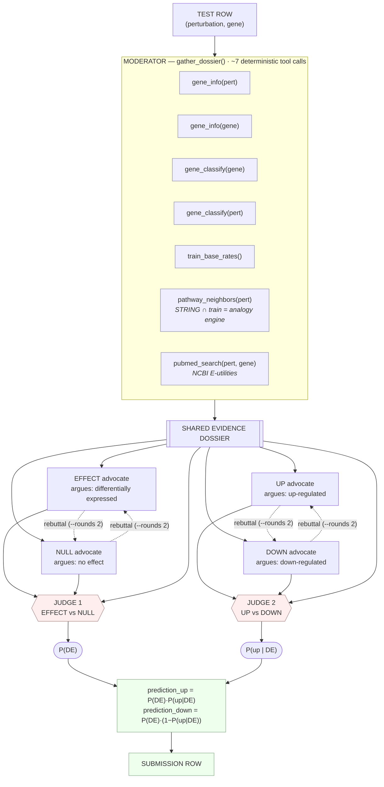

# Track B — Adversarial Debate Agent Architecture

Implementation: [`examples/track_b_adversarial.py`](../examples/track_b_adversarial.py)
· tools: [`examples/tools/`](../examples/tools/)
· benchmark: [`examples/benchmark_track_b.py`](../examples/benchmark_track_b.py)

## Why this shape

The competition metric is the **mean of two _independent_ AUROCs** (see
[`kaggle_metric.py`](../kaggle_metric.py)):

- **DE AUROC** — `(up + down)` vs `none`, scored by `prediction_up + prediction_down`
- **DIR AUROC** — `up` vs `down` among DE-positive rows, scored by
  `prediction_up / (prediction_up + prediction_down)`

So the architecture splits into **two adversarial debates**, each optimizing
exactly one component, and the final arithmetic falls straight out of the metric:

```
prediction_up   = P(DE) ·  P(up | DE)
prediction_down = P(DE) · (1 − P(up | DE))
P(none)         = 1 − prediction_up − prediction_down      (implicit)
```

Because the train/test split is disjoint on **both** the perturbation and gene
axes, a test pert/gene never appears in train and exact lookup is useless. The
`pathway_neighbors` tool is the linchpin: it converts an unseen perturbation
into *seen* analogues via STRING ∩ train (e.g. `Stat1` → `Jak1`/`Irf9`/`Ifnar1`/`Tyk2`,
whose knockdowns are 9-down / 0-up). Because AUROC rewards *ranking*, the judges
emit **continuous, calibrated probabilities**, not hard labels.

The moderator gathers evidence **once per row** (~7 tool calls), so even the
deepest config (`--rounds 2`: 8 advocate + 2 judge calls) stays far under the
250-call budget.

## Mermaid



## Knobs

| Flag | Values | Effect |
|------|--------|--------|
| `--judge-mode` | `logprob` _(default)_ | Softmax over the A/B answer-token top-logprobs → continuous probability (the calibration lever that won Track A; needs the server started via `serve_with_logprobs_fix.py`). |
| | `numeric` | Parse `<prob>NN</prob>` from the judge. Coarser, but no logprob plumbing. |
| `--rounds` | `0` | No advocates — judges score the dossier directly (ablation baseline). |
| | `1` _(default)_ | Each advocate argues once, then the judge decides. |
| | `2` | One rebuttal round (each side rebuts the other) before judging. |
| `--advocate-effort`, `--judge-effort` | `low` / `medium` / `high` | GPT-OSS reasoning budget per role. |

## ASCII (quick reference)

```
                          ONE TEST ROW:  (perturbation, gene)
                                        │
                                        ▼
        ┌───────────────────────────────────────────────────────────────────┐
        │  MODERATOR — deterministic evidence gathering (7 tool calls)        │
        │  gene_info(pert/gene), gene_classify(pert/gene), train_base_rates,  │
        │  pathway_neighbors(pert) [STRING ∩ train], pubmed_search(pert,gene) │
        │                       → SHARED EVIDENCE DOSSIER                     │
        └───────────────┬───────────────────────────────────┬─────────────────┘
                        │                                     │
        ┌───────────────┴──────────────┐    ┌─────────────────┴────────────────┐
        │  DEBATE 1 → DE                │    │  DEBATE 2 → DIR                   │
        │  EFFECT advocate ⇄ NULL adv.  │    │  UP advocate ⇄ DOWN advocate      │
        │        (rebuttal if rounds=2) │    │        (rebuttal if rounds=2)     │
        │              ▼                │    │              ▼                    │
        │      JUDGE 1 → P(DE)          │    │      JUDGE 2 → P(up | DE)          │
        └───────────────┬──────────────┘    └─────────────────┬────────────────┘
                        └──────────────┬───────────────────────┘
                                       ▼
                   prediction_up = P(DE)·P(up|DE)
                   prediction_down = P(DE)·(1 − P(up|DE))
```
